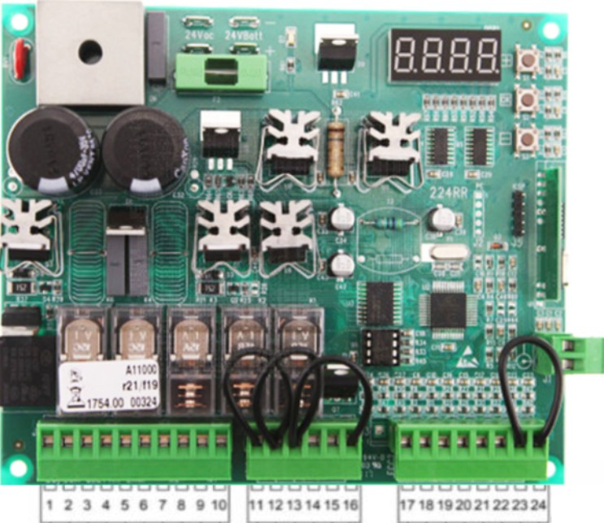
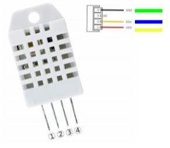
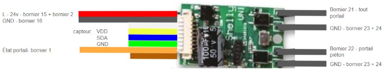
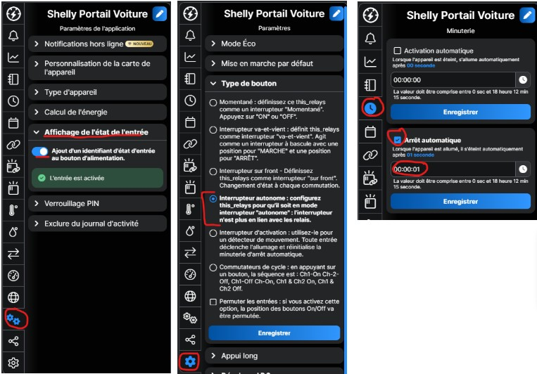
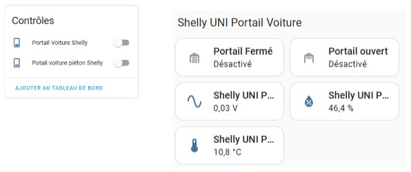

# Automatisation d'un Portail avec Shelly Uni et DEA System 224RR

## Introduction
Ce guide explique comment utiliser un Shelly Uni pour automatiser un portail avec un contrôleur DEA System 224RR.

## Matériel Nécessaire
- Un contrôleur DEA 224RR
- Un Shelly Uni
- 7 câbles pour prolonger le câble du Shelly
- Une plaque à soudure de petite taille
- Un capteur de température

## Schéma de la Carte Mère DEA 224RR

## Schéma du Capteur de Température

## Schéma de Montage

## Configuration du Shelly Uni
### Paramétrage des Boutons
1. **Activer l'entrée** : Allez dans les paramètres de l'application et activez l'affichage de l'état de l'entrée.
2. **Configurer le type de bouton** : Dans les paramètres, sélectionnez "Interrupteur autonome".
3. **Minuterie** : Configurez l'arrêt automatique à 00:00:01.

## Intégration avec Home Assistant
Le capteur de température et d'humidité s'intègre automatiquement dans Home Assistant sans configuration supplémentaire.

## Conclusion
Ce projet permet d'automatiser un portail en utilisant des composants simples et accessibles.

